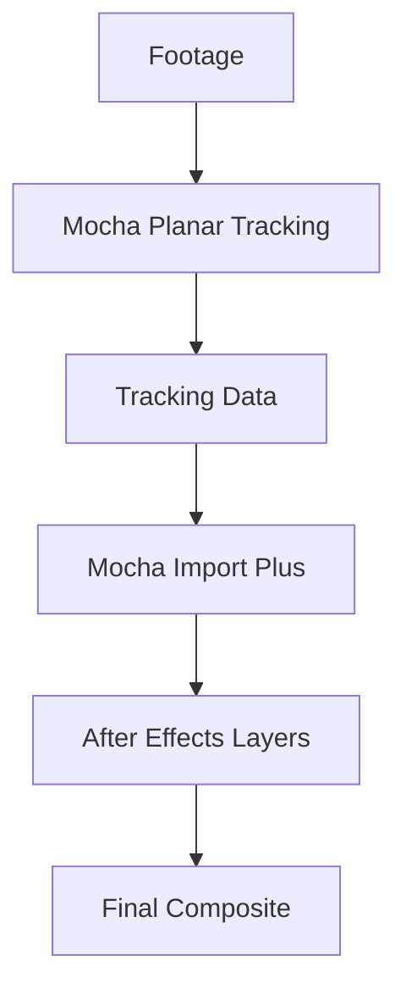

# Mocha Import Plus 

Tracking is memory.
It remembers where things were, how they moved, how the world shifted between frames.

And **Mocha Import Plus** is the quiet bridge between that memory and motion.

No ceremony. No friction. Just data — flowing cleanly from analysis to animation.

Built by **Boris FX**, this plugin exists for artists who trust Mocha’s planar tracking, but demand a faster, clearer path into **Adobe After Effects**. It doesn’t reinvent tracking — it *honors* it.

---

## Overview 🧭

**Mocha Import Plus** is a dedicated utility that transfers tracking data from **Mocha Pro** and **Mocha AE** directly into After Effects with surgical precision.

Instead of rebuilding motion by hand, it allows you to:

* Import corner pins
* Apply transforms
* Generate masks
* Link tracking to layers instantly

It’s not flashy — and that’s exactly why professionals love it.

---

## What Mocha Import Plus Does Best 🔍

This plugin lives in the space *after* tracking — where clarity matters most.

### 📐 Planar Tracking Import

Bring Mocha’s planar data into AE exactly as intended.

* Position, scale, rotation
* Perspective and shear
* Stable, jitter-free motion
* No interpretation loss

Perfect for:

* Screen replacements
* Sign tracking
* Object inserts
* Set extensions

---

### 🧩 Corner Pin & Surface Transfer

Complex motion, simplified.

* Auto-generate Corner Pin effects
* Apply tracking to solids, precomps, or footage
* Match Mocha surfaces precisely
* Preserve perspective over time

What once took minutes now takes seconds.

---

### 🎭 Mask & Shape Data

Edges that stay where they belong.

* Import masks directly from Mocha
* Convert splines into AE shape layers
* Maintain feathering and animation
* Ideal for rotoscoping workflows

> [!NOTE]
> Masks imported via Mocha Import Plus remain fully editable inside After Effects.

---

### ⚙️ Flexible Application Options

Control how data arrives.

* Apply to selected layers
* Generate new tracking nulls
* Choose coordinate space
* Stack multiple tracks cleanly

Precision without clutter.

---

## Why VFX Artists Rely on It 💠

Mocha Import Plus doesn’t ask for attention.
It *earns* trust.

**Creative advantages**

* Eliminates manual rebuilding
* Preserves Mocha accuracy
* Keeps timelines clean
* Reduces human error

**Technical strengths**

* Lightweight and stable
* Designed for production pipelines
* Zero render overhead
* Predictable, repeatable results

This is the kind of tool that quietly saves projects.

---

## Typical Workflow ⚙️

1. Track surface in Mocha
2. Save or export project
3. Open After Effects
4. Launch Mocha Import Plus
5. Choose data type (Corner Pin, Mask, Transform)
6. Apply — and continue compositing

No rebuilding.
No second guessing.
Just motion, remembered correctly.

---

## Tracking Transfer Logic 🧠

Accuracy flows forward — untouched.

---

## Frequently Asked Questions ❓

**Is Mocha Import Plus for beginners?**
Yes, though it shines brightest in professional workflows.

**Does it replace Mocha?**
No — it complements it. Mocha tracks; Import Plus transfers.

**Can I edit data after import?**
Absolutely. Everything remains editable in After Effects.

**Is it useful for simple screen replacements?**
It’s one of the best tools available for that task.

**Does it work with multiple tracks?**
Yes — complex scenes are handled cleanly.

> [!IMPORTANT]
> Always name and organize Mocha layers clearly — clean data in means clean composites out.

---

## Final Thoughts 🌫️

Mocha Import Plus is not about spectacle.
It is about *fidelity*.

Fidelity to motion.
Fidelity to intention.
Fidelity to the invisible labor that makes visual effects believable.

When tracking disappears into the shot — when nothing calls attention to itself — that is when this plugin has done its job.

Quiet accuracy.
Reliable bridges.
Motion that remembers where it came from.

---
